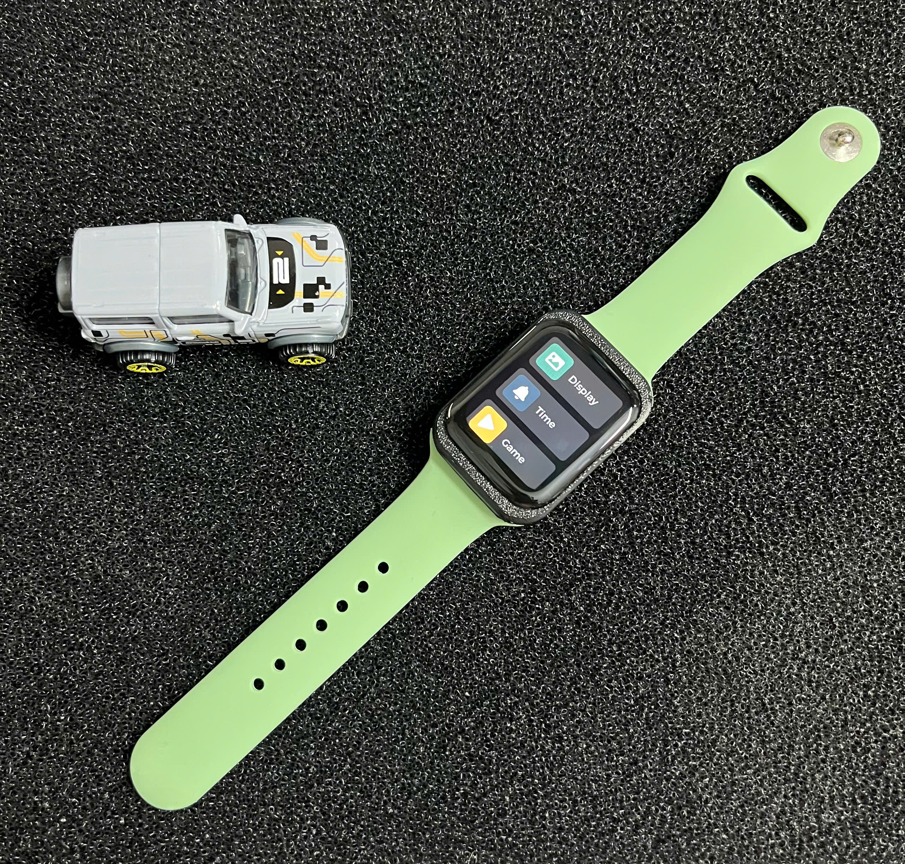
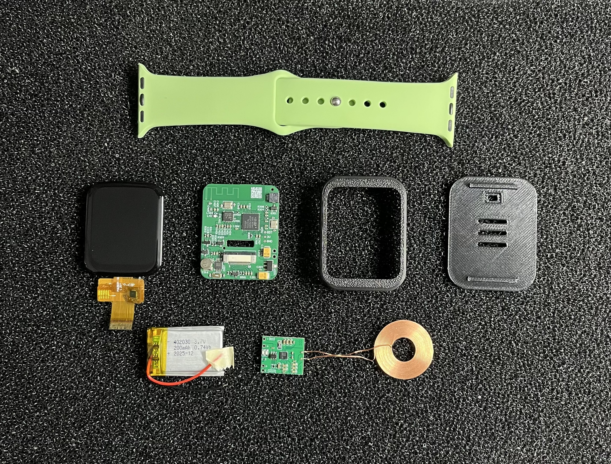
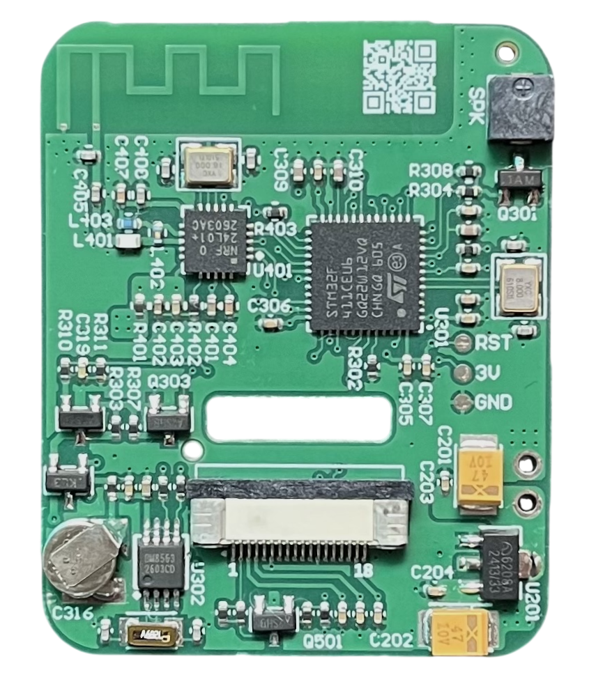
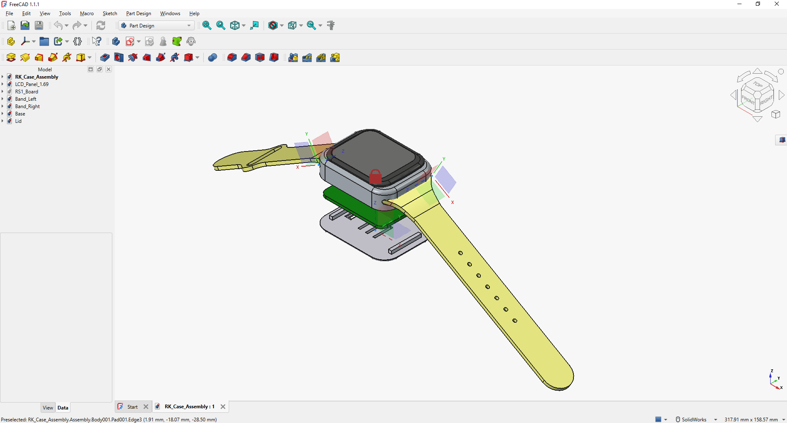

## RK Smartwatch

    

 

RK Smartwatch is a smartwatch project developed with the purpose of being a showcase embedded product for applying the RK real-time operating system (Modern Preemptive RTOS) in embedded software development on microcontrollers

Key features:

- Display time, date, month, and year
- Gaming (with Flappy Bird built in)
- Weather forecast

### 1. Purpose
The product helps learners get hands-on with key concepts in embedded software development:

- Developing asynchronous applications on an Event-Driven architecture
- Building and organizing the user interface (UX/UI) with LVGL
- Firmware OTA: Over-the-air firmware updates for STM32 via nRF24L01
- Organizing data transmission and reception (Link) over physical media (Serial, RF, etc.)

### 2. Hardware
#### Components

    

 

The build consists of:
- Case (3D-printed)
- PCBA board
- Battery & Wireless charging
- Apple Watch strap

#### PCB Assembly

    

 

The board is designed in accordance with DFM (Design for Manufacturing) standards.

Manufacturing resources: [Download](https://github.com/Gao-Den/rk-smartwatch/tree/main/rk-smartwatch-stm32f411/hardware/manufacturing)

#### Mechanical

    

 

The project resources include the attached 3D-printable files.

3D Print: [Download](https://github.com/Gao-Den/rk-smartwatch/tree/main/rk-smartwatch-stm32f411/hardware/mechanical/3d-part)

#### UX/UI Design

    

 

The interface and screen transitions are designed in Figma. Design reference: [Download](https://github.com/Gao-Den/rk-smartwatch/tree/main/rk-smartwatch-stm32f411/application/sources/app/screen/references)

### 3. Firmware:

| Resource                      | Description |
| ------                        | ------ 
| rk-smartwatch-stm32f411       | The RK Smartwatch |
| rk-flash                      | The firmware update application for the watch |
| rk-link                       | The programmer that takes data from the flashing application and packages it into packets for transmission over RF |
| esp32-s3-weather-station      | The weather station that broadcasts weather packets to the watch over RF |

### 4. References:

| Topic                     | Link |
| ------                    | ------ 
| RKOS                      | https://github.com/Gao-Den/rkos |
| AK Embedded Base Kit      | https://github.com/ak-embedded-software/ak-base-kit-stm32l151 |
| Active Object Model       | https://www.state-machine.com/doc/AN_Active_Objects_for_Embedded.pdf |